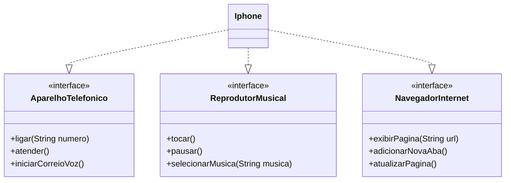

# Bootcamp DIO Santander 2024 - Backend Java
## Trilha Java Básico
### Desafio: POO - Lançamento Iphone 2007

Projeto para atender ao desafio "POO - Lançamento do Iphone 2007".

[Github do desafio](https://github.com/digitalinnovationone/trilha-java-basico/tree/main/desafios/controle-fluxo)

O desafio é composto por 2 atividades:

- **UML do iPhone**: contida abaixo, neste documento.
- **Implementação Java** do UML: armazenada na pasta "/src".

---
## UML do iPhone

---
#### Para pesquisar todos os desafios, por favor acesse a [branch main](https://github.com/alexandre-melgarejo/dio-java-basico/tree/main) e consulte o readme.md.
